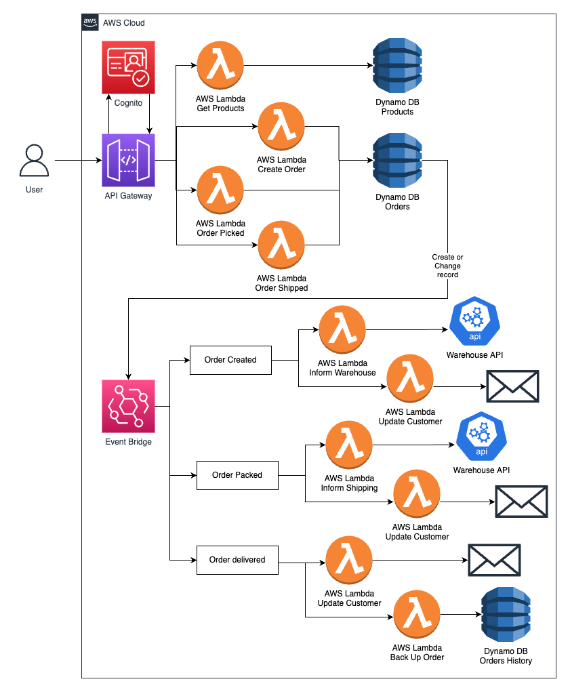

# e-Commerce System with AWS Serverless Application Model and Event Driven Design

| Key          | Value                                                                                 |
| ------------ | ------------------------------------------------------------------------------------- |
| Environment  |                                                                      |
| Services     | GoLang, SQS, SNS, Lambda, DynamoDB, EventBridge, Cognito, Dependency Injection                                 |
| Integrations | AWS SAM CLI                                                                            |
| Categories   | Serverless; Event-Driven architecture                                                   |
| GitHub       | [Repository link](https://github.com/qkhuyit/aws-sam-event-driven-ecommerce)   |
| Ref       | https://www.freecodecamp.org/news/learn-serverless-aws-by-building-7-projects/   |

## Introduction
This project will teach you about Event Bridge, plus give you some extra practice with DynamoDB Table design and services like SES and SNS for email and text.

This system will have products and filtering, carts and orders as you would expect. The key here is that order placement, order status changes, and delivery updates will all be handled through Event Bridge.

## Architecture

